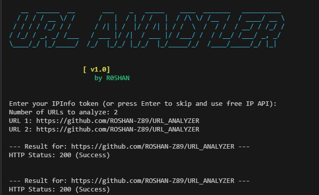

<h1 align="center">🔍 URL Analyzer</h1>

<p align="center">
  
  
  
  
  
  <br><br>
  
  
  
</p>

---
## 🖼️ Screenshot

<p align="center">
  
</p>
---

## 🧠 Description

**URL Analyzer** is a lightweight yet powerful Python tool designed to inspect, validate, and flag potentially malicious or suspicious URLs. Ideal for cybersecurity researchers, ethical hackers, bug bounty hunters, or anyone looking to demystify URLs.

---

## 🚀 Features

| Feature | Description |
|--------|-------------|
| ✅ Subdomain Counter | Analyze and count subdomains from any URL. |
| 🌐 Scheme Validation | Flags dangerous or uncommon schemes like `ftp://`, `file://`, etc. |
| ⚠️ SSRF Risk Detection | Detects access to localhost, internal IPs, or intranet targets. |
| 📦 .env Integration | Load API keys and configs securely from environment variables. |
| 🧠 ISP Lookup (IPInfo) | Fetches ISP and geo info using IPInfo API. |
| 🎨 Terminal Styling | Color-coded terminal output using `termcolor`. |
| 🧹 Auto Clear | Clears terminal screen after error or interruption. |
| 🧪 URL Parsing | Dissects scheme, domain, subdomains, port, etc. |
| 🔎 Input Validation | Gracefully handles broken or malformed URLs. |

---

📦 Installation

🔧 On Debian-based Systems (Ubuntu, Kali, etc.)
```bash
sudo apt update && sudo apt install git python3 python3-pip -y
git clone https://github.com/ROSHAN-Z89/url-analyzer
cd url-analyzer
pip3 install -r requirements.txt
python3 analyzer.py
```
🧪 On Arch-based Systems (Arch, Manjaro, EndeavourOS)
```bash
sudo pacman -S git python python-pip --noconfirm
git clone https://github.com/ROSHAN-Z89/url-analyzer
cd url-analyzer
pip install -r requirements.txt
python analyzer.py

```
📱 On Termux (Android)
```bash
pkg install git python -y
git clone https://github.com/ROSHAN-Z89/url-analyzer
cd url-analyzer
pip install -r requirements.txt
python analyzer.py
```
Options
```
  usage: python3 main.py
```
## 📌 What's New in v1.1?
✅ Graceful Fallback for Missing IPInfo Token
In previous versions, if users didn’t provide a valid ipinfo token, the script would crash or exit with an error.
Now fixed — the tool skips IP info gathering but continues processing the rest of the URL analysis, allowing users without API keys to still benefit from the other features.  
  
### [*] Support
####  Want to show support? Just spread the word and smash the star button


## [~] Find Me on :

- GitHub: [ROSHAN-Z89](https://github.com/ROSHAN-Z89)
- [](mailto:rouson.ece@gmail.com)
- [](https://www.linkedin.com/in/rouson-das-563b52284/)
